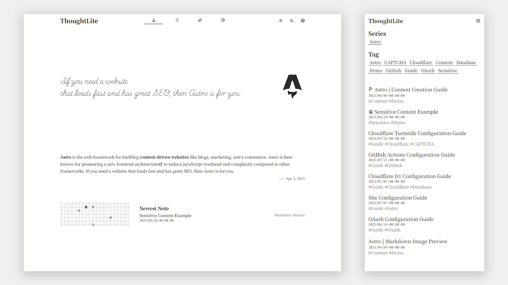
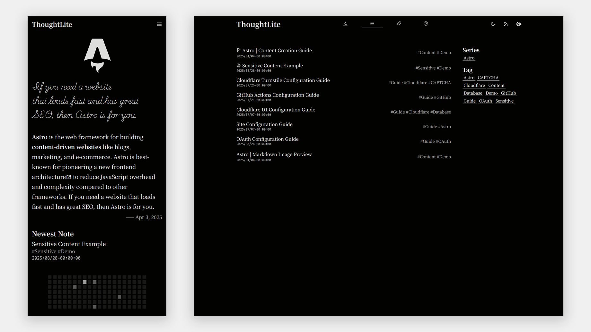

# ThoughtLite

<div align="center">
    <p>
        
        
    </p>
    <p>
        <a href="https://github.com/tuyuritio/astro-theme-thought-lite/releases/latest"></a>
        <a href="https://raw.githubusercontent.com/tuyuritio/astro-theme-thought-lite/refs/heads/main/LICENSE"></a>
        <a href="https://deepwiki.com/tuyuritio/astro-theme-thought-lite"></a>
    </p>
    <p>一款专注内容创作的现代化 <a href="https://astro.build/">Astro</a> 主题 🌟</p>
    <p>
        <small><a href="README.md">English</a></small>
        <small><ins>简体中文</ins></small>
        <small><a href="README.ja.md">日本語</a></small>
    </p>
</div>

> [!NOTE]
> - 这个仓库现在只保留博客前端静态站点。
> - 评论、登录、邮件验证、推送等后端服务已独立在服务器侧运行，并通过同源 `/@/*` 接口接入。

🎬 **在线演示**：[Cloudflare Workers](https://thought-lite.ttio.workers.dev/zh-cn/)

## ✨ 特性

- [x] **响应式设计** - 移动端、平板、桌面自适应。
- [x] **亮色 / 深色模式** - 自动跟随系统，并支持手动切换。
- [x] **CSR 动态内容筛选** - 通过 History API 实现的列表筛选和分页。
- [x] **i18n 支持** - 可扩展的多语言支持，单语言模式同样适用。
- [x] **Sitemap 及 Feed 订阅** - 自动化生成 Sitemap 和 Atom Feed。
- [x] **OpenGraph 支持** - 内置 Open Graph 元标签，优化社交媒体分享效果。
- [x] **评论前端** - 页面端直接通过同源 `/@/*` 接口接入独立后端服务。
- [x] **静态部署友好** - `pnpm build` 直接产出静态站点，适合 GitHub + Netlify 工作流。

## 📋 前期准备

在开始之前，请确保至少有：

- [GitHub 账户](https://github.com/signup) - 用于代码托管和自动部署
- 一个静态托管平台账户（如 Netlify） - 用于部署前端产物 `dist/`

## ⚡️ 快速上手

### 使用 Astro 命令

运行如下命令：

```sh
pnpm install
pnpm dev
```

### 使用模板

1. [使用此模板](https://github.com/new?template_name=astro-theme-thought-lite&template_owner=tuyuritio)创建新的仓库（启用 `Include all branches`）或 [Fork](https://github.com/tuyuritio/astro-theme-thought-lite/fork) 此仓库（取消勾选 `Copy the main branch only`）。
2. 运行如下命令：

```sh
git clone <your-repo-url>
cd <your-repo-name>
pnpm install
pnpm dev
```

## 🔧 配置

前端仓库主要只维护静态站点本身：

1. 自定义站点配置及国际化（i18n）配置，请修改以下文件：
    - `astro.config.ts`
    - `site.config.ts`
2. 内容创作与页面结构调整请集中在 `src/content`、`src/pages`、`src/components`。
3. `/@/*` 后端接口由服务器上的独立服务提供，不在这个仓库里维护。
4. 前端仓库不再在构建期读取评论系统的后端能力开关，Netlify 侧无需额外同步那套服务端私有配置。

## 💻 命令

主题提供了以下常用命令：

| 命令 | 行为 |
| --- | --- |
| `pnpm install` | 安装项目依赖 |
| `pnpm update` | 更新项目依赖 |
| `pnpm new` | 创建新的内容文件 |
| `pnpm dev` | 启动本地开发服务器（默认：`http://localhost:4321`） |
| `pnpm check` | 运行 Astro 类型检查 |
| `pnpm build` | 构建生产版本 |
| `pnpm preview` | 预览构建后的站点 |
| `pnpm format` | 代码格式化 |
| `pnpm lint` | 代码检查 |

## 🚀 部署

```sh
pnpm build
```

将生成的 `dist/` 发布到静态托管平台即可。若使用 GitHub + Netlify，则当前仓库已经内置 [netlify.toml](/Users/renxiqing/blog/server-blog/netlify.toml)：

- 前端构建命令固定为 `pnpm build`
- 发布目录固定为 `dist`
- `/@/*` 会由 Netlify 反向代理到 `https://blog-api.hollowdobt.com/@/*`

这样评论、登录、邮件等请求仍由现有服务器侧后端继续承接，但浏览器访问保持在同一个 `blog.hollowdobt.com` 域名下。

## 🏗️ 当前运行原理

当前线上博客已经是明确的“前端 Netlify + 后端服务器”结构：

1. `blog.hollowdobt.com` 这个子域名的 DNS 由 Netlify 托管，并直接由 Netlify 负责 TLS 证书和静态文件分发。
2. 当前仓库只负责生成前端静态产物；Netlify 从 GitHub 拉取本仓库，执行 `pnpm build`，再发布 `dist/`。
3. 浏览器访问页面时，HTML、CSS、JS、图片等静态资源都由 Netlify 返回。
4. 评论、登录、邮件验证等后端请求仍然保持原来的同源路径 `/@/*`，但这些请求会被 [netlify.toml](/Users/renxiqing/blog/server-blog/netlify.toml) 反向代理到 `https://blog-api.hollowdobt.com/@/*`。
5. `blog-api.hollowdobt.com` 再由服务器上的 Nginx 转发到本机评论/用户服务，因此后端逻辑仍然完全跑在你自己的服务器上。

换句话说：

- 前端访问速度与全球分发，主要由 Netlify 负责。
- 评论与用户系统的数据、接口和稳定性，仍然由你自己的服务器负责。
- 浏览器看到的域名始终是 `blog.hollowdobt.com`，所以前端现有交互不需要改成另一套 API 域名。

## 🔁 当前更新流程

当前仓库的标准前端发布流程已经切成：

```sh
git add -A
git commit -m "your message"
git push
```

执行后会发生：

1. 代码推到 GitHub 仓库 `HollowDobt/blog-site` 的 `main` 分支。
2. Netlify 监听到这次 GitHub push，自动触发新的生产构建。
3. Netlify 执行 `pnpm build`，并把新的 `dist/` 发布到 `blog.hollowdobt.com`。
4. `/@/*` 仍然继续回源到你服务器上的后端服务，因此前端更新不会重启或替换后端。

注意：

- 这个前端仓库今后默认应该推 GitHub，不应该再把它当作服务器生产发布仓库使用。
- 如果你只更新前端内容，不需要登录服务器部署任何前端文件。
- 服务器侧后端仍然独立运行，除非你主动改后端服务，否则它不会因为前端仓库的 push 被覆盖。

## 🔄 更新

运行以下命令以同步上游前端主题更新：

```sh
git remote add theme https://github.com/tuyuritio/astro-theme-thought-lite.git
git fetch theme
git merge theme/main  # 首次更新需添加 `--allow-unrelated-histories` 参数
pnpm install
```

## ✍️ 创作

创作内容集中在 `src/content` 目录下，主要包含以下部分：

- `note` - 文记，专注于精心构思、内容详实的长篇作品
- `jotting` - 随笔，轻量级、即时性的内容记录
- `preface` - 序文，作为第一印象在站点首页展示
- `information` - 信息，包含各类说明性内容

详情请参阅[内容创作指南](src/content/note/zh-cn/content.md)。

## 🤝 贡献

欢迎并感谢所有形式的贡献！

- 宣传项目或帮助其他用户
- 提交 [issues](https://github.com/tuyuritio/astro-theme-thought-lite/issues) 或新功能建议
- 改进文档及国际化（i18n）支持
- 贡献代码
- 更多信息请参阅[代码贡献指南](CONTRIBUTING.md)

## 🙏 鸣谢

### 技术栈

- **核心框架** - [Astro](https://astro.build/)
- **核心语言** - [TypeScript](https://www.typescriptlang.org/)
- **UI 组件** - [Svelte](https://svelte.dev/)
- **CSS 引擎** - [Tailwind CSS](https://tailwindcss.com/)
- **图标** - [Iconify](https://iconify.design/)
- **字体** - [Google Fonts](https://fonts.google.com/) | [ZeoSeven Fonts](https://fonts.zeoseven.com/)
- **图片查看器** - [Medium Zoom](https://github.com/francoischalifour/medium-zoom)
- **SPA 过渡** - [Swup](https://swup.js.org/)
- **代码质量** - [Biome](https://biomejs.dev/)

### 灵感来源

- [Astro Sphere](https://github.com/markhorn-dev/astro-sphere)
- [astro-vitesse](https://github.com/adrian-ub/astro-vitesse)
- [Miniblog](https://github.com/nicholasdly/miniblog)
- [AstroPaper with I18n](https://github.com/yousef8/astro-paper-i18n)

## 📜 许可证

本项目采用 [GPLv3](LICENSE) 进行授权，可自由修改与分发，但须保留原版权声明。
