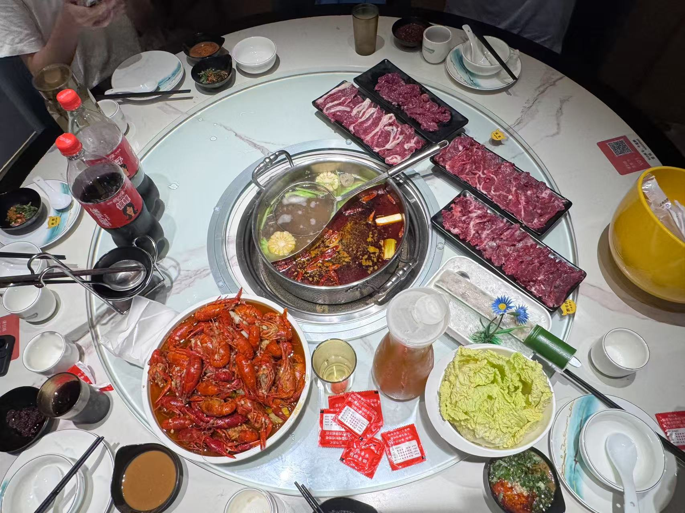
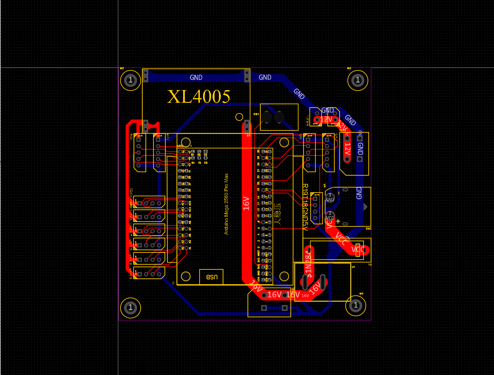



该怎么形容呢? 离开学也就剩两三周了. 虽然不像高中时代那样每时每刻都紧迫得喘不过气, 但假期即将落幕时, 心里还是会涌起一种空落落的感觉. 不过这可能是我度过的最充实的一个暑假了吧. 或者说, 是一个最漫长的, 长到仿佛过了一整个学期的暑假.


## 六月底 June: 农机人校内赛
---

复杂的团队协作, 第一次熬一整夜.


期末终于结束, 我长舒了一口气. 寝室里的另外三人都迫不及待地收拾好行李, 早早离校了. 除了还要参加农业机器人俱乐部培训的我, 整个寝室里空无一人. 虽说无人在意的世界的确自在, 但常常也是无聊的.

休息的那两天, 我几乎都宅在寝室里, 研究 `C++` 和 `Agent` 相关的知识. 因为还报名了另一场难度更高的比赛, 我计划提前学习一些对我而言相当陌生的知识. 不过后面实际操作时证明, 此时学的大部分知识一点儿用也没有.

休息的日子结束后就是日夜颠倒, 不分昼夜, 甚至熬穿的机器人制造时光. 在这场以合作为中心的竞争中, 因为从小到大几乎没和别人合作过, 我在面对别人的问题几乎会毫不留情地阴阳怪气. 我对我的组员们深表歉意, 每个人的起点不同, 从零设计的思想本身也很容出现问题, 我不该就因为一些鸡毛蒜皮的小问题发脾气. 虽然大家的操作确实令人气馁, 但彼时正是在备赛, 遇到问题不应该抱怨问题, 而是耐心等待并帮助解决问题. 即使一个人的能力再强, 如果这个人没有相关技能, 也应该只是在旁边默默看着. 漫长而重复的错误确实容易令人崩溃, 无所事事而且因为要写程序走不了确实很无聊, 所以当时的我心情相当糟糕, 希望你们可以谅解.

在这场比赛中, 我发现自己的技术力已经远超想象. 比如编写一个类似于 `C++` 的语言 `Arduino` 时, 在另一位写代码的同学花费一个多小时时间难以解决车辆移动问题的情况下, 我竟然能在缺少静态检查器的情况下在二十分钟内完成代码重构和修复并且直接编译成功, 让小车能够按照预期逻辑进行移动. 这让我意识到, 之前出于兴趣花大把时间做的各种算法题和程序设计题的确很好的锻炼了我的代码思维.

这场比赛最令我难忘的一天(如果算熬夜的话其实是两天), 自然是比赛的最后一天. 由于前期在结构和电路上出现了大量意想不到的问题, 再加上整车缺少日志输出系统的设计, 因此我们几乎没有时间完成车辆代码的编写. 为了尽可能保证小车可以走完全程, 我第一次把夜熬穿了. 从小到大, 这是我第一次完整地看着天空破晓: 黑暗的夜被黎明撕裂, 大地重新被光照亮.

最后, 尘埃落定了. 我们组因为结构设计和电路设计存在严重缺陷, 再加上程序设计并不完美适配这一机器, 因此拿到了相当糟糕的成绩. 大家伙倒也没什么悲伤的, 毕竟许多人本来也只是想体验一下. 包括我自己. 对我们来说, 或许不觉得悲伤, 只是深感遗憾. 时间太短了, 一切都来不及, 我们本可以做得更好.

我们组最终选择了一家火锅店作为这场比赛的结尾. 大家聊得很开心, 天南海北, 各自家乡的特色, 一些有趣的回忆, 高中与大学如何如何, 这桌菜怎样怎样. 应该说我们走了狗运, 当时这家店正好有小龙虾促销, 贵两块钱就可以拿三大份小龙虾. 再加上一堆牛肉, 虾滑, 蔬菜, 这顿饭吃的是相当开心. 尽管我们这六个人只是七天的"拼好队", 甚至相互之间名字都没记住, 但是我们真的都很开心! 后来正式组队很多人都走了, 但这似乎也无关紧要了.


  
  
  
  
  
  


## 七月初 July: 南京之行
---

这是段奇葩的旅程. 天气太热, 果然宅在家里才是王道.


吃完散伙饭后, 我在寝室休整了一天. 狠狠补觉, 发誓要把前些天熬的夜都补回来!

不就之后, 我去了另一座城市小住了一段时间. 那里的夏天实在闷热, 走在街头仿佛置身蒸笼. 除了偶尔出去逛逛老街, 其余时间基本都宅在室内, 看看资料, 刷刷视频. 这倒也算是另一种"度假"了.

开始这趟小旅行原本还有别的原因, 但阴差阳错, 最后成了一次纯粹的吃喝放松之旅. 印象最深的是某次再次吃到花雕醉虾, 味道果然鲜美, 让人回味.

不过玩归玩, 心里仍免不了挂念一些事. 作为这次行程本来的目的, 毕竟身边的亲人好多都有健康问题生活压力, 谁都不容易. 尽管我始终认为, 赚钱固然重要, 身体还是首位, 但是他们真的见过穷死的人.

不久后, 我启程返回. 为了节省宝贵的白天时间, 我选择了跨夜的动卧列车. 在出发前和老哥吃了顿晚饭, 告别时心里涌起一股复杂的情绪. 毕竟很多地方虽然年年常在, 但那里的人却早已变了样.

动卧的体验也蛮有意思的. 虽然四人间的空间比想象中舒适, 但我始终觉得设计得有些不太合理. 互不相识的人之间竟然没有帘子, 如果能给每个床位都配上帘子就更好了. 本来打算在车上玩玩电脑, 但另外三个乘客早早睡了, 我也就作罢.

最让我不习惯的是床位方向, 总觉动车启动后随时会"滚下去". 实际上有个栏杆挡着, 咋可能掉的下去. 结果反而被这些胡思乱想折腾得没睡踏实. 不过再回想起来, 这也算是一段新鲜体验吧.


	
	
	


## 七月初 - 七月中旬 June: 拿驾照
---


那么, 这就拿到驾照咯?



回家之后的第一天, 我就开始练习科目三了. 寒假的时候挂了一次, 加上教练异常凶残, 我对于科目三训练其实是有心理阴影的. 我觉得这或许是一种 PTSD? 每每想到科目三就十分害怕.

这是一幅什么样的画面呢? 我开着开着, 教练狠狠地啐了一口, 而后破口大骂, 我前面不是教过吗? 而后我弱弱地反驳, 您话都说不清楚, 我根本听不懂您的意思是什么. 然后是他就破防继续骂, 我只得闭嘴, 对比之下, 另一位偶尔教我的教练温文尔雅, 吐字清晰, 讲话有理有据, 以他作为主教练的学员们确实幸甚至哉. 

虽然过程是艰苦的, 令人痛不欲生的, 但是结果还是比较好的. 科目三过了. 很好, 不用三战了. 备考科目三时, 我吸取了之前的经验, 先别考虑其他问题, 所以没有慌着去做科目四的练习. 我打算先歇几天, 瞧着哪天有空再去考科目四.

在休息的那几天, 我花了一些时间准备做 `agent` 需要的知识, 回了趟老家看看爷爷奶奶, 吃了顿亲戚的满月宴, 还去高中伙着另外几人看了自己的老师. 说来惭愧, 因为种种原因, 很多老师我都没有亲自去看过. 即使这次去, 也只是简单拜访和吃顿饭. 每每想到我都想着要不回去看看, 因为他们中的许多人确实都是值得钦佩的人. 可每次都是各种原因被我推脱, 然后即使去了也是, 发现大家确实没什么共同话题. 最好笑的一位老师是, 谈着谈着没话说了, 竟然开始分析几位同学的高中成绩了.

科目四自然很顺利地通过了, 我拿到了驾照. 一开始训练时做到了许多奇葩题, 搞得我哭笑不得, 还有点害怕考试如果考这么逆天咋个办. 好在最后考试没考那些奇葩题. 可惜无车能开, 不然拿到驾照的我肯定挑战去城区开个十几圈.

这段时间我总算是有了一种感觉, 就是正面击溃了自己心魔的感觉. 因为第一次科目三并不是技术不行挂掉的, 如同许多考试的同学一样是被各种各样的意外给打败的. 当时觉得特别不甘心, 尤其在我发现因为时间问题只能留到暑假再考的时候. 而这一次考科目三, 我再遇风雨天考试, 再次遇到了意外. 运气同样不太好, 但是这次, 是我赢了.



​	

​	

​	

​	

​	

​	

​	



## 七月中旬 - 八月中旬 June, July: 智库索引, 启动!

---



几乎一个人完成了这个玩具项目: 智库索引.



应该怎么说呢, 即使是八月十五结束了, 我还是恋恋不舍. 这个项目主要参与人有两个, 中间插进来一个, 三个人对彼此都算十分熟悉, 因此我本来觉得应该很顺利就能做完这个项目. 

好吧, 事与愿违, 这个项目的进展实际上一波三折. 最关键的一点是, 两个同学似乎都不怎么愿意编码. 他们的情况似乎和我当初在校内赛中遇到的情况差不多, 都是我在不知不觉的练习中代码能力变得越来越强. 尤其是对于程序设计的理解, 他们两人几乎无法理解我为什么可以让一个过程成为稳定的代码, 以及为什么有些过程很难实现. 这其实有些好笑, 因为他们都学过 `C++` 了, 面对稍微难一些的问题竟然手足无措.

除此之外, 因为一开始计划存在严重问题, 前面几天的时间几乎都打了水漂. 为了挽救这个快要死掉的项目, 我在 7 月 26 号的时候向许多老师请教, 重新设计了程序运行的思路. 我决定, 不再使用复杂的算法, 而是使用模拟人行为的方式直接实现.

这一过程相当漫长. 这像是, 花了整整二十多天的时间写完了一道题. 不得不说, `AI` 真好用, 可以说很大程度上帮助我这个毛头小子可以在没有写工程代码经验的前提下能够完成这个项目. 这个过程中遇到的基本上都是技术上的问题, 我在思考过一段时间后基本都可以顺利解决. 这里就不细讲了, 感兴趣的话可以看看我下面提供的代码仓库. 尽管最后的作品还不够满意, 像个没啥用的玩具, 但是完成度还是不错的.

这个过程相当累人, 需要一点一点批改两个小白队友和 `AI` 写的 `shit`, 需要每天都思考下一个代码怎么写, 分给他们什么任务比较合适. 但总的来说还是愉快的. 尤其是在中途大家相互请客吃了几顿饭, 感觉好久不见的朋友们的心再次凝聚在了一起.

回头看, 我发现做开源项目对提升代码能力的作用远比折腾配置的作用要大. 这次项目结束后, 我原本预计要三天才能完成的这个博客主题的自定义, 竟然只花半天就搞定了.



## 尾声: 即将结束的暑假

---

其实离开学还早着呢. 还有两周多的时间供我挥霍. 尽管不想浪费了, 但是我必须承认, 自己的精力已经被花的七七八八了. 尽管所有东西都做的很开心, 作品都算是自己的, 再加上伙伴和老师们都很友好, 而且科三科四也顺利过了, 但是自己确实太累了. 我也问了问 `AI`, 他说我简直是劳模呀, 是该放松放松了. 就该多摸鱼呀.

这是一个难忘的暑假. 因为无数个第一次, 因为做的事太多了. 这让我误以为又过了一个学期.

不管如何, 再会了. 容我先休息一会儿. 我得为后面的挑战养精蓄锐.